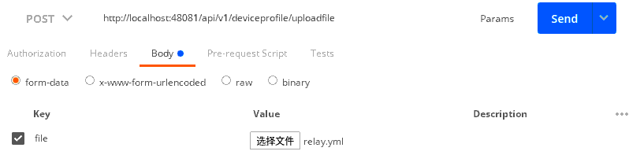
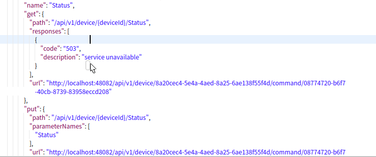

# 1. 添加profile

post方法

使用 http://localhost:48081/api/v1/deviceprofile/uploadfile 上传文件



或者使用 http://localhost:48081/api/v1/deviceprofile/upload

填充body， 用raw的test(json)传

```yml
name: relay profile
manufacturer: xx
model: ModBus-1
labels: [relay]
description: relay profile
deviceResources: 
- description: relay
  name: Relay
  properties:
    value:
      type: INT16
      readWrite: R
      defaultValue: "0"
      size: "1"
      scale: "1"
      mediatype: ""
    units:
      type: String
      readWrite: R
  attributes:
    primaryTable: HOLDING_REGISTERS
    startingAddress: "1"
- description: relayStatus
  name: Status
  properties:
    value:
      type: UINT8
      readWrite: R
      defaultValue: "0"
      size: "1"
      scale: "1"
      mediatype: ""
    units:
      type: String
      readWrite: R
  attributes:
    primaryTable: COILS
    startingAddress: "1"
deviceCommands:
- name: Relay
  get:
  - index: "1"
    operation: get
    object: Relay
    parameter: Relay
- name: Status
  get:
  - index: "1"
    operation: get
    object: Status
    parameter: Status
  set:
  - index: "1"
    operation: set
    object: Status
    parameter: Status
coreCommands:
- name: Relay
  get:
    path: /api/v1/device/{deviceId}/Relay
    responses:
    - code: "200"
      description: Get the Relay state
      expectedValues:
      - Relay
    - code: "503"
      description: service unavailable 
- name: Status
  get:
    path: /api/v1/device/{deviceId}/Status
    responses:
    - code: "200"
      description: Get the Relay state
      expectedValues:
      - Status
    - code: "503"
      description: service unavailable 
  put:
    path: /api/v1/device/{deviceId}/Status
    parameterNames: ["Status"]
    responses:
    - code: "204"
      description: Set the Relay state
      expectedValues: []
    - code: "503"
      description: service unavailable 
```

# 2. 添加设备

post http://localhost:48081/api/v1/device

注意大写

```json
{
    "description": "",
    "name": "relay device",
    "adminState": "UNLOCKED",
    "operatingState": "ENABLED",
    "protocols": {
        "modbus-rtu": {
            "Address": "/dev/ttyUSB0",
            "BaudRate": "115200",
            "DataBits": "8",
            "Parity": "N",
            "StopBits": "1",
            "UnitID": "1"
        }
    },
    "labels": [
        "relay",
        "Modbus RTU"
    ],
    "service": {
        "name": "edgex-device-modbus",
        "adminState": "UNLOCKED"
    },
    "profile": {
        "name": "relay profile"
    }
}
```

# 3. 验证命令

获取command

get http://localhost:48082/api/v1/device

找到所要的设备



之后 get或者put即可

http://localhost:48082/api/v1/device/8a20cec4-5e4a-4aed-8a25-6ae138f55f4d/command/08774720-b6f7-40cb-8739-83958eccd208

put时，json如下

```json
{"Status":"255"}
```

其中0~255对应8位继电器的状态