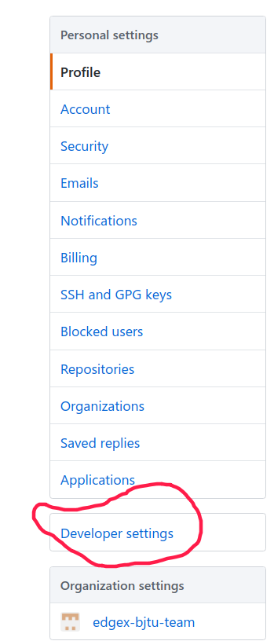
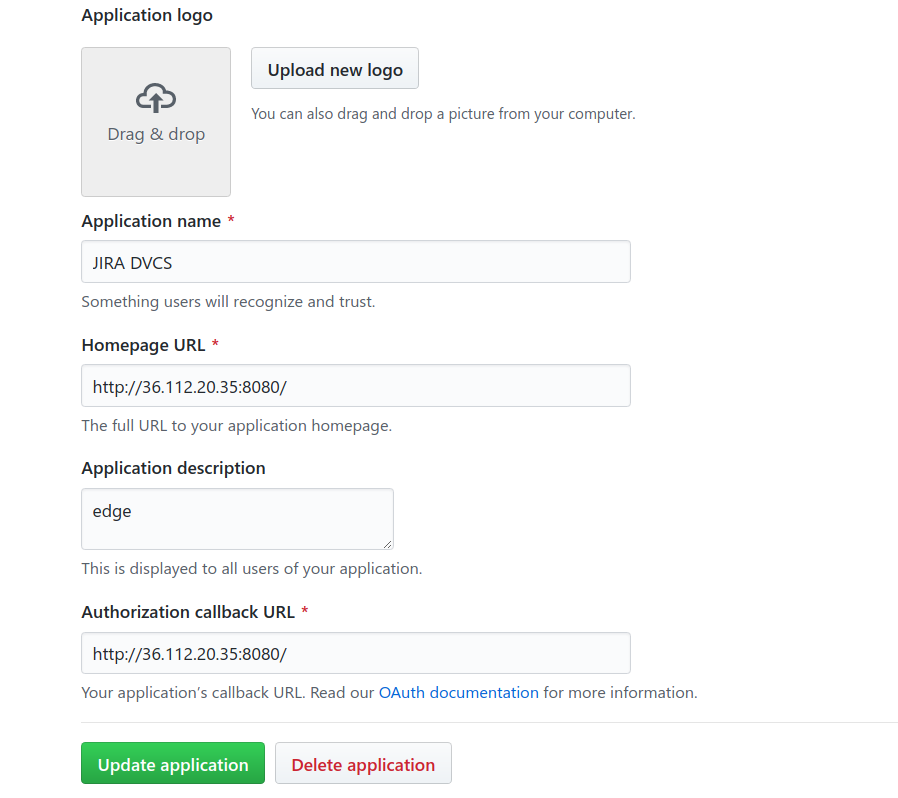
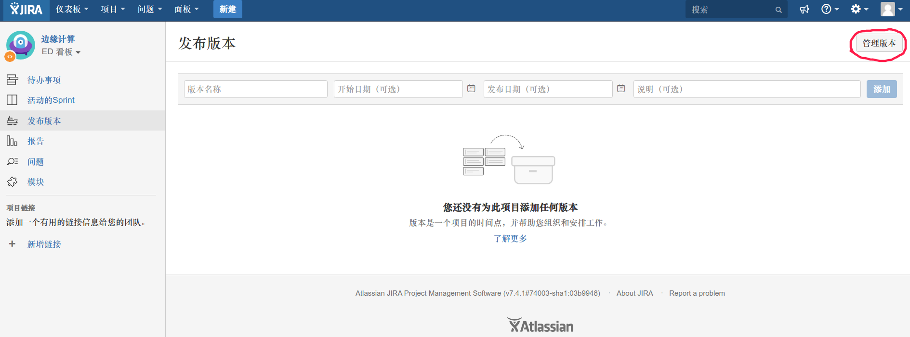
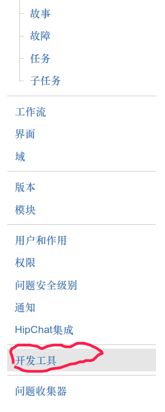
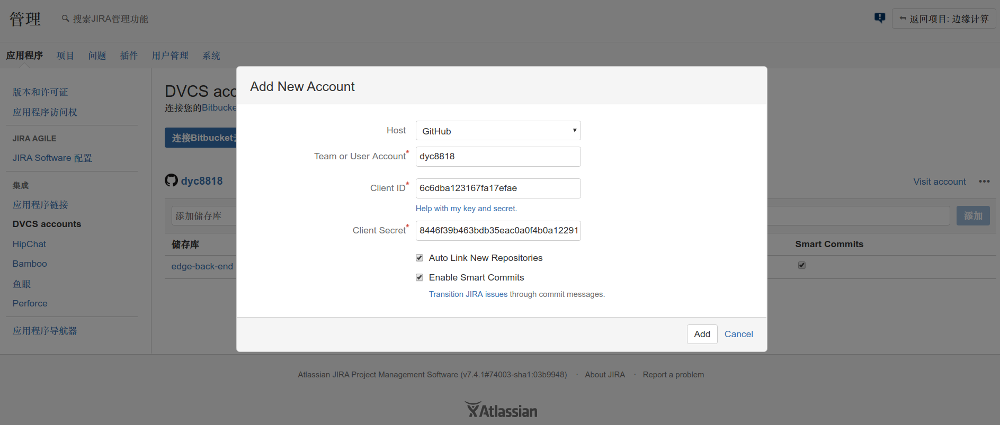
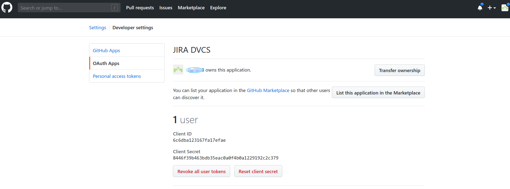
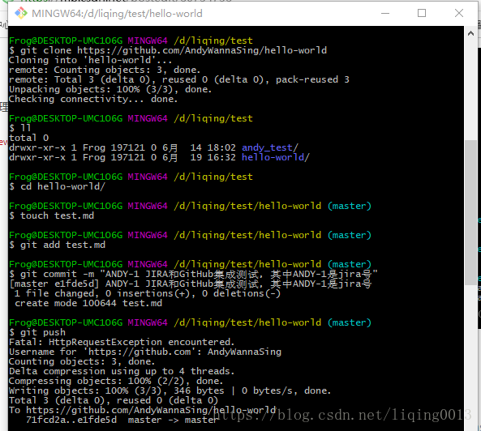
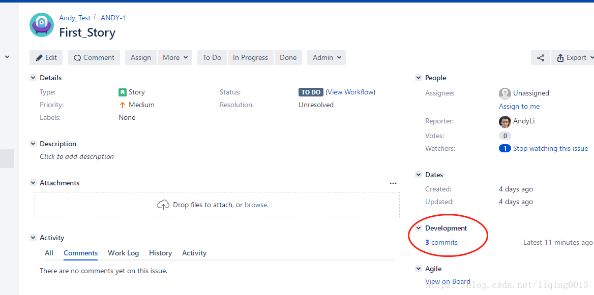
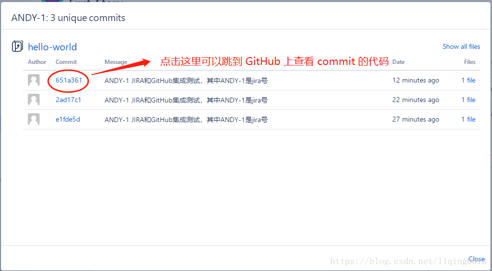
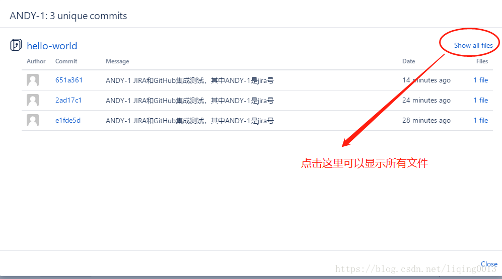

# 一、集成准备

1、JIRA 账号。

2、GitHub 账号

# 二、集成步骤

    要集成 JIRA 和 GitHub，首先需要在 GitHub 上新建一个用于校验访问权限的 token，然后把这个 token 配置到 JIRA 上。
    
    用来集成的 JIRA 账号和 GitHub 账号都需要有管理员权限。

## 1、登录 GitHub ，新建 OAuth access token

    点击 “setting”-"developers setting"：

​    

点击“Register a new application”，进行新建页面。

Application name 这里设置为 JIRA DVCS

Homepage URL 和 Authorization callback URL 设置为 JIRA 账号的基础路径（base url），这里设置为：http://36.112.20.35:8080/

 Application description 设置为：edge

      

​        

##  2、登录 JIRA，配置链接

用admin账户登录，点击管理版本

  点击开发工具

 点击“Link Bitbucket Cloud or GitHub account”：

添加的内容是github上生成的

## 3、测试集成效果

从 GitHub 下载一个项目，修改一些文件，提交这些改动的时候，commit 信息设置为“JIRA号 备注信息”。下面以 hello-world 项目为例进行演示：

​        

       

 
