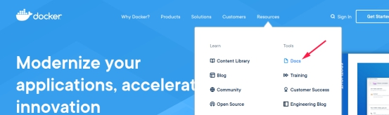
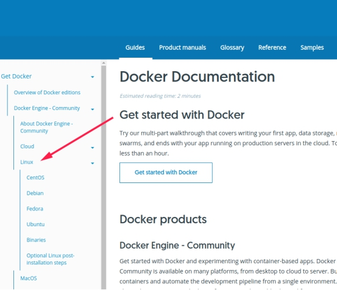
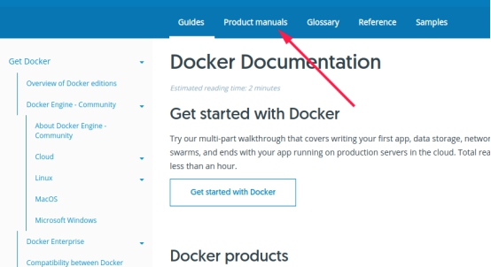
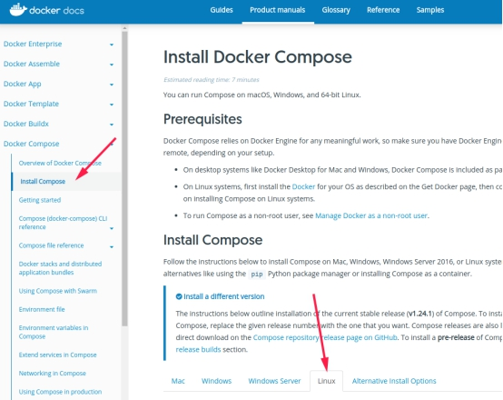
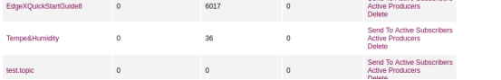

部署edgex Edinburgh流程

# 1.安装docker和docker-compose

按照官网流程就好

## 1.1 安装docker-CE

 

 

如果是deepin系统，想自己电脑上装的话，按照Debian的来就行。

然后装docker compose

 

 

 

# 2 从docker hub上拉edgex镜像

把docker-compose.yml放到一个目录下，然后在这个目录里用终端执行 

*docker-compose up -d*

进入http://localhost:8500/	可以看到已开启的微服务。

如果想要关闭的话，也是要进这个目录执行

*docker-compose down*

这个yml文件里有些模块的功能没开，如果要开的话，就把前面注释符号去掉，然后

*docker-compose up -d*  *<服务名称>*

 

# 3. 添加设备

用目前的这个modbus温湿度传感器举例，具体流程可以看edgex foundry官方文档。

https://docs.edgexfoundry.org/

添加设备模板配置文件

如果edgex在其他地方运行，请用IP替换localhost

使用POST TO http://localhost:48081/api/v1/deviceprofile/uploadfile

上传yml文件，

或使用POST TO  http://localhost:48081/api/v1/deviceprofile/upload

上传yml格式的内容。

目前这个device profile内容如下，有一些以后做相同工作需要注意的地方：

```yml
name: temperature and humidity sensor profile
manufacturer: xx
model: ModBus-1
labels: [Temperature,Humidity]
description: temperature and humidity sensor profile
deviceResources:
- description: sensor temperature
  name: TemperatureDeg
  properties:
    value:
      type: INT16（注意数据类型，根据设备说明书看要读几个字节，还有要不要小数啥的）
      readWrite: R
      defaultValue: "0"
      size: "1"
      scale: "0.1"（数据是否需要乘以系数来矫正）
      mediatype: ""
    units:
      type: String
      readWrite: R
  attributes:
    primaryTable: HOLDING_REGISTERS
    startingAddress: "2"（起始地址的顺序根据设备说明书来）
- description: sensor humidity
  name: Humidity
  properties:
    value:
      type: INT16
      readWrite: R
      defaultValue: "0"
      size: "1"
      scale: "0.1"
      mediatype: ""
    units:
      type: String
      readWrite: R
  attributes:
    primaryTable: HOLDING_REGISTERS
    startingAddress: "1"
deviceCommands:（这个在老版本写得是resources，爱丁堡改成了deviceCommands，如果参照网上的模板，一定要注意）
- name: TemperatureDeg
  get:
  - index: "1"
    operation: get
    object: TemperatureDeg
    parameter: TemperatureDeg
- name: Humidity
  get:
  - index: "1"
    operation: get
    object: Humidity
    parameter: Humidity
coreCommands:（这个在老版本写得是commands，爱丁堡改成了coreCommands，如果参照网上的模板，一定要注意）
- name: TemperatureDeg
  get:
    path: /api/v1/device/{deviceId}/TemperatureDeg
    responses:
    - code: "200"
      description: Get the temperature in degrees F
      expectedValues:
      - TemperatureDeg
    - code: "503"
      description: service unavailable
- name: Humidity
  get:
    path: /api/v1/device/{deviceId}/Humidity
    responses:
    - code: "200"
      description: Get the Humidity
      expectedValues:
      - Humidity
    - code: "503"
      description: service unavailable
```

然后添加value descriptor，按照官方文档来就好。

再然后，按照官方文档的说法要给即将连的设备添加addressable，但是我加了之后再get看信息发现完全没加上，而且没加也能用，我不是很清楚到底怎么说，但是我就撒手不管了哈哈哈哈哈。

添加设备之前一定要确定设备服务在运行，这里用的是device-modbus 。

最后通过POST TO http://localhost:48081/api/v1/device

添加特定设备，这里请求中传的JSON如下

```json
{
    "description": "",
    "name": "temp and humidity device",
    "adminState": "UNLOCKED",
    "operatingState": "ENABLED",
    "protocols": {
        "modbus-rtu": {
            "Address": "/dev/ttyUSB0",
            "BaudRate": "9600",
            "DataBits": "8",
            "Parity": "N",
            "StopBits": "1",
            "UnitID": "1"
        }
    },
    "labels": [
        "temp",
        "Modbus RTU"
    ],
    "service": {
        "name": "edgex-device-modbus",
        "adminState": "UNLOCKED"
    },
    "profile": {
        "name": "temperature and humidity sensor profile"
    }
}
```

Profile和 service 名称要与之前的一致。

Protocols这一项如果没有，post的时候会报错，而且特意还说是少protocol字段。我猜可能是因为之前addressable没加上。所以这一块虽然官方文档没加在API的例子里，但是一定要有。现在不确定是因为modbus-rtu不走tcp所以不需要addressable而是要指定protocols具体参数，还是因为文档没更新，所以这块建议根据设备试一下。

Protocols里面的address是docker挂载宿主机设备之后，新的路径，具体设置在docker-compose.yml中，相应的设备服务模块下面，devices这一项里做路径映射。我因为太菜了差点被这个映射搞死。请一定要注意。

Protocols其他的参数设置请参考设备说明书。

其他协议的情况就去看官方文档吧，我啥都不懂，流下了好菜的泪水。

# 4. 测试

如果之前的设置有问题，可以考虑找找API文档里的PUT请求改一下。

可以访问[http://localhost:4000](http://localhost:4000/)

账号密码都是admin，进入之后可以便捷的使用一些基本功能。

这里要说的是必须新建网关，并且选中之后才能继续点左侧导航栏的其他分类。

新建网关的地址是docker中的主机地址，一般linux默认是172.17.0.1，但是可能会根据具体情况不同而不同，可以在终端执行

*ip addr show docker0*

来查看ip。

# 5. 安装MQ

为了简单，目前使用的是activeMQ，可以去官网直接下。

然后在相应目录下使用

*tar -xzf <文件名> -C /解压路径*

解包文件，然后进入解压的路径中，

*cd /apache-activemq-5.15.9/bin/*

*sudo ./activemq start*

启动。

要结束的话就是

*sudo ./activemq stop*

然后访问http://localhost:8161/

可以查看 管理MQ，账号密码依然admin。具体的配置文件暂不赘述。

# 6. 配置edgex导出层

POST TO http://localhost:48071/api/v1/registration

内容依然是JSON，以目前的例子

```json
{
"name":"ExportTest",	（导出代理名称，唯一，不重复）
"addressable":{        （MQ服务器信息）
"name":"mqtt", 
"protocol":"tcp",
"address":"172.17.0.1",  （这里的IP是docker中看主机的IP，如果不是本地运行MQ就用真实IP）
"port":1883,     （端口号，与协议相关，MQTT协议默认用1883）
"publisher":"EdgeXExportPublisher1", 
"user":"user",       （给MQ发送消息的用户、密码）
"password":"user",
"topic":"Tempe&Humidity"  （指定topic，所有监听此topic的订阅者均可接收到与topic相符的消息，也可粗暴的理解为队列名称）
},
"format":"JSON",
"filter":{
"deviceIdentifiers":["temp and humidity device"]（选择要导出什么设备的数据）
},
"enable":true,
"destination":"MQTT_TOPIC" （指定协议类型，不能随便写）
}
```

可以进入MQ查看

 

根据topic可以在服务器后端用JMS监听直接接收消息。